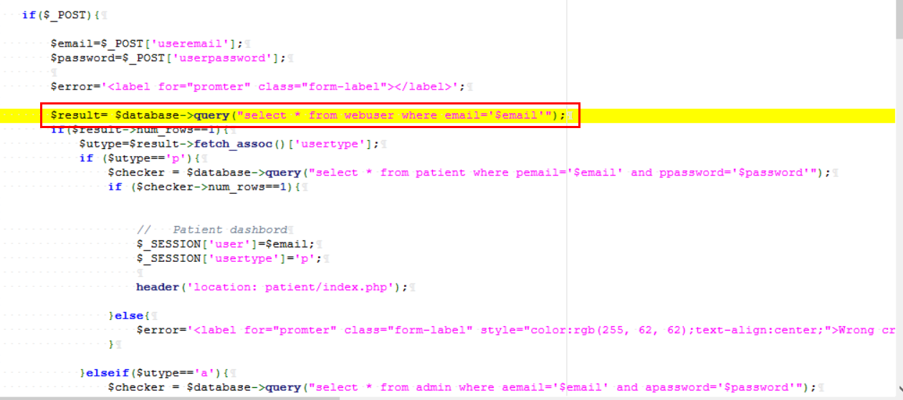
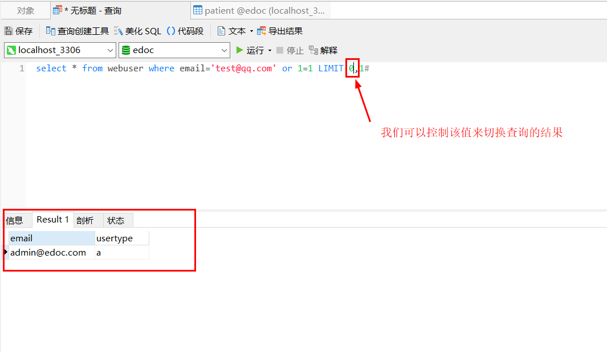
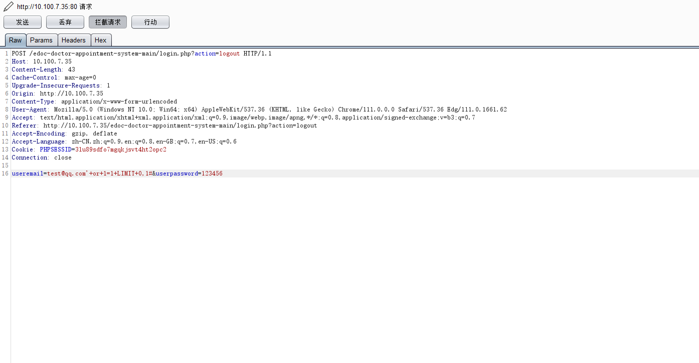

## SOURCECODESTER DOCTOR'S APPOINTMENT SYSTEM login SQL injection

 

**Description:**

A vulnerability classified as severe has been discovered in the SOURCECODESTER DOCTOR'S APPOINTMENT SYSTEM. The vulnerability arises in the login program section of the file login.php. The operation of parameters useremail and userpassword leads to SQL injection, and the limit of SQL queries can be controlled to cause any user to log in to the system, including administrator users. This will pose a serious threat to system security and sensitive data within the system. Even disrupting the normal use of the system!

### Project Source

**Source website:**https://www.sourcecodester.com/hashenudara/simple-doctors-appointment-project.html

**Github Address:**https://github.com/HashenUdara/edoc-doctor-appointment-system

 

### Recurrence of vulnerabilities

The environment has been successfully built, and the homepage URL is http://10.100.7.35/edoc-doctor-appointment-system-main/  

There are login and registration operations in the upper right corner. We will select the login function point for testing

By analyzing the source code, when obtaining the incoming email from the front-end, concatenate SQL for query operations. When a result is found, determine which if branch to enter based on the value of the role information utype in the query result, that is, select which role to log in to

So when constructing a universal password, we need to consider that we can only control the SQL query to produce one statement, so we can construct test@qq.com 'or 1=1 LIMITED 0,1 # is the login username, which can successfully query a statement. Due to our control of LIMITED 0,1, it was found that admin@edoc.com So we entered admin@edoc.com ](mailto: So enter admin@edoc.com ）Password judgment program

So, the code will enter the if branch below

When the username is test@qq.com When 'or 1=1 LIMITED 0,1 # passes in the SQL statement of this branch, a result can also be queried

So we can construct a universal password test@qq.com 'or 1=1 LIMITED 0,1 # to log in to the system.
Below, we will modify the username after packet capture to a universal password for system login
There is an operation in the front-end to detect special symbols. We will bypass it by capturing packets and first enter a valid username

Then capture the packet and modify the value of useremail to[ test@qq.com '+or+1=1+LIMIT+0,1#](mailto: test@qq.com '+or+1=1+LIMIT+0,1#)
Note: In burpsuite, the+sign represents a space.

 

Modify and release the package, successfully log in to the Administrator backend

It is sufficient to prove the existence of SQL here, and no further SQL injection data operations will be carried out